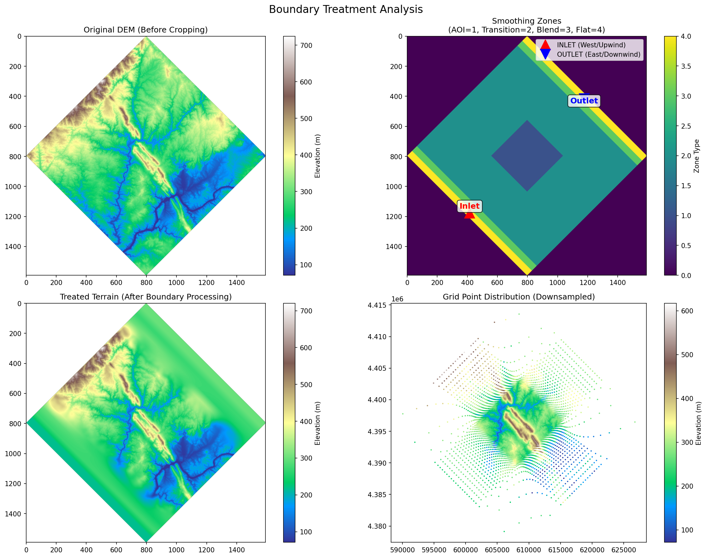
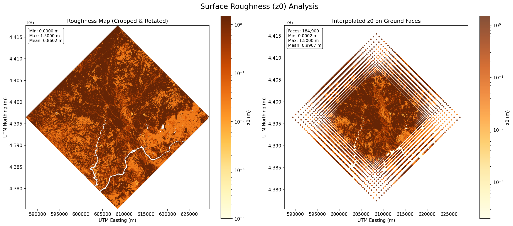
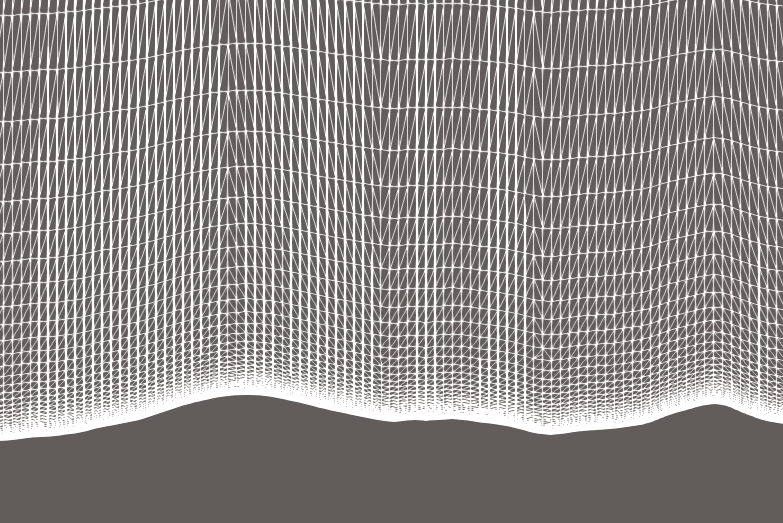

# Terrain-Following Mesh Generator for Atmospheric Simulations (OpenFOAM)

This tool generates a structured, terrain-following orthogonal mesh for atmospheric simulations in OpenFOAM.  
It processes elevation data (DEM) and optional roughness maps to produce a `blockMeshDict` and aerodynamic roughness field (`z0`).

---

## Features

- Automatic surface roughness mapping (ESA WorldCover)
- Structured, graded terrain mesh generation
- Terrain-following vertical extrusion
- Boundary treatment to reduce edge effects
- Multi-block grading support
- Outputs ready for OpenFOAM (`blockMeshDict`, `z0`)
- Mesh sanity visualization

---

## Workflow

1. Load DEM (and optional roughness map)
2. Extract and rotate terrain region
3. Apply boundary treatment
4. Generate structured mesh
5. Extrude vertically
6. Export `blockMeshDict`
7. Map `z0` roughness values

---

## Installation

```bash
git clone https://github.com/souravsud/terrain_following_mesh_generator.git
cd terrain_following_mesh_generator
```

```bash
conda env create -f environment.yml
conda activate tfmesh
```

```bash
pip install .
# or (development)
pip install -e .
```

---

## Quickstart

```bash
python run.py --config terrain_config.yaml --dem terrain.tif --output ./output
```

---

## Usage

### CLI

```bash
python run.py --help

python run.py --config terrain_config.yaml --dem terrain.tif --output ./output

python run.py --dem terrain.tif --rmap roughness.tif --output ./output

python run.py --dem terrain.tif --verbose
```

> `--dem` is required. You must provide your own DEM (GeoTIFF / DAT / NetCDF).

---

## Inputs

Supported formats:
- GeoTIFF (auto reprojected to UTM)
- DAT (UTM format)
- NetCDF (2D coordinate grids)

---

## Configuration

Minimal example:

```yaml
terrain:
  crop_size_km: 30
  rotation_deg: 225

grid:
  nx: 200
  ny: 200

mesh:
  total_z_cells: 50
```

📘 Full configuration guide: [docs/configuration.md](docs/configuration.md)

---

## Examples

See `examples/`:
- `simple_example.py`
- `advanced_example.py`

---

## Output

- `system/blockMeshDict`
- `0/include/z0Values`
- Optional visualization plots

---

## Demo

### Output figures

  


### Mesh slice

