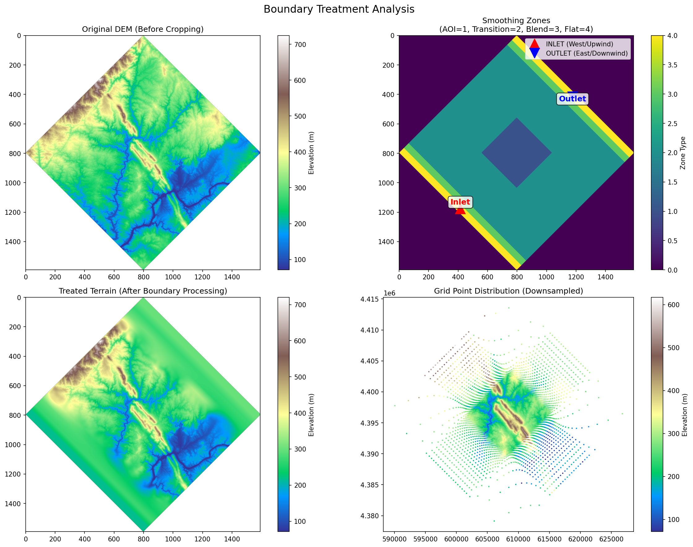
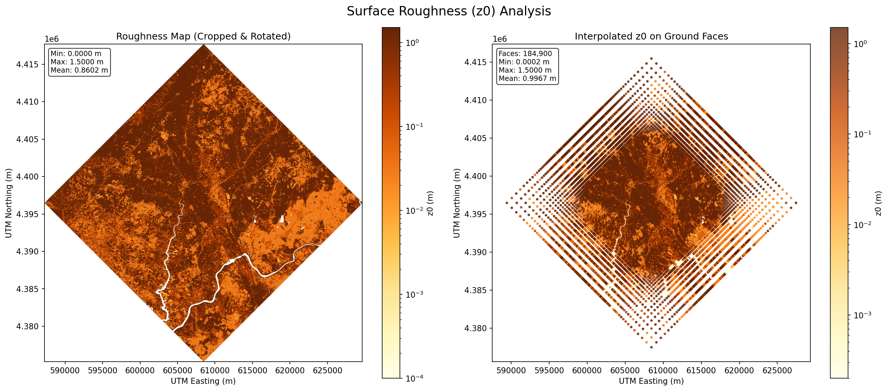
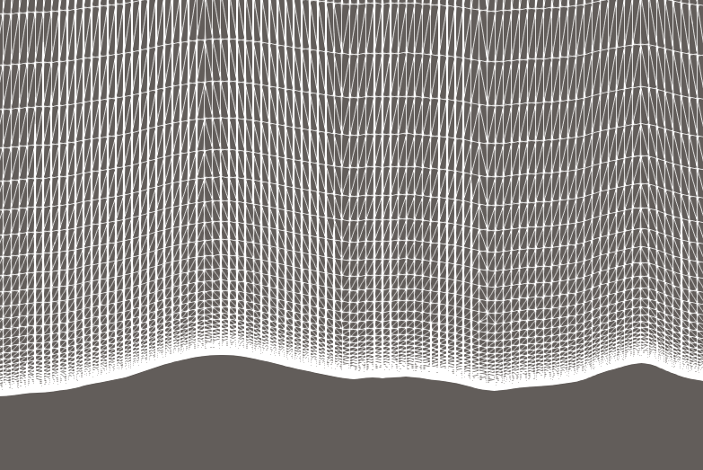

# Terrain-Following Mesh Generator for Atmospheric Simulations (OpenFOAM)

Generates structured, terrain-following orthogonal meshes for atmospheric boundary layer (ABL) simulations in OpenFOAM. Processes elevation data (DEM) and optional roughness maps to produce a `blockMeshDict` and aerodynamic roughness field (`z0`).

---

## Features

- Multi-format DEM ingestion: GeoTIFF (auto-reprojected to UTM), DAT, NetCDF
- Auto-detection of UTM centre from DEM metadata (no lat/lon required)
- Rotated terrain crop aligned to the wind direction
- **Smooth-step boundary treatment** — progressive C¹ blend from full terrain in the AOI to a flat inlet/outlet face, with no artificial banding or smoothing artefacts
- Multi-block graded structured mesh (OpenFOAM `simpleGrading` compatible)
- Terrain-following vertical extrusion with optional terrain-normal first layer
- Automatic surface roughness mapping from ESA WorldCover or custom rasters
- Constant roughness synthesis when no raster is available (ML dataset use)
- OpenFOAM outputs: `blockMeshDict`, `z0Values`, `inletFaceInfo`
- Paired terrain/roughness NPZ maps for ML training datasets

---

## Workflow

1. Load DEM (and optional roughness map)
2. Crop and rotate terrain region to wind direction
3. Apply 3-zone boundary treatment (AOI → smooth-step transition → flat face)
4. Generate structured horizontal grid with multi-block grading
5. Extrude vertically (terrain-following)
6. Export `blockMeshDict` and `z0` field
7. Save terrain/roughness maps as NPZ

---

## Installation

```bash
git clone https://github.com/souravsud/terrain_following_mesh_generator.git
cd terrain_following_mesh_generator
```

```bash
conda env create -f environment.yml
conda activate tfmesh
```

```bash
pip install -e .
```

---

## Quickstart

```bash
python run.py --config terrain_config.yaml --dem terrain.tif --output ./output
```

---

## Usage

### CLI

```bash
python run.py --help

python run.py --config terrain_config.yaml --dem terrain.tif --output ./output

# With roughness map
python run.py --dem terrain.tif --rmap roughness.tif --output ./output

# Verbose logging
python run.py --dem terrain.tif --verbose
```

> `--dem` is required. Provide your own DEM (GeoTIFF / DAT / NetCDF).

---

## Inputs

| File | Format | Notes |
|------|--------|-------|
| DEM | GeoTIFF, DAT, NetCDF | Auto-reprojected to UTM if geographic CRS |
| Roughness map | GeoTIFF, NetCDF | Optional — constant fallback used if absent |

---

## Configuration

Minimal working example:

```yaml
terrain:
  crop_size_km: 30
  rotation_deg: 225

grid:
  nx: 200
  ny: 200

mesh:
  total_z_cells: 50
```

📘 Full configuration reference: [docs/configuration.md](docs/configuration.md)

---

## Boundary Treatment

The boundary treatment enforces numerical stability at the inlet and outlet by dividing the domain into three zones in the flow direction:

```
|── flat ──|──── smooth-step transition ────|──── AOI ────|──── smooth-step ────|── flat ──|
  ~5–8 %            ~20–35 %                  ~30–50 %          ~20–35 %          ~5–8 %
  constant       C¹ blend to target          untouched      C¹ blend to target   constant
```

- **AOI** — original terrain, fully preserved.
- **Smooth-step** — elevation blended from 100 % real terrain at the AOI edge toward the target using `w = 3t²−2t³`. No additional smoothing of the DEM is applied.
- **Flat zone** — constant elevation at the target, ensuring ABL log-law inlet/outlet profiles are applied on flat ground.

The target elevation is computed by fitting a Theil-Sen line through the transition zone (collapsed to a 1-D median profile in the flow direction) and extrapolating to the flat-zone boundary. When `clamp_target: true`, the result is capped at the median of the real terrain in the flat zone to prevent the face from being raised above the actual terrain on upward-sloping domains.

Corner pixels (the side-boundary bands outside the flow-direction strips) are left as original terrain.

---

## Examples

See `examples/`:
- `simple_example.py`
- `advanced_example.py`

---

## Output

```
output/
├── system/
│   └── blockMeshDict
├── 0/include/
│   ├── z0Values
│   └── inletFaceInfo.txt
├── maps/
│   ├── terrain_map.npz      # elevation, x, y (vertex + cell-centre arrays)
│   └── roughness_map.npz    # z0, x, y (vertex + cell-centre arrays)
└── pipeline_metadata.json
```

---

## Demo

### Boundary treatment zones and treated terrain



### Roughness analysis



### Mesh slice



---

## Changelog

### 1.1.0
- **Boundary treatment rewrite**: replaced multi-scale pyramid approach (which produced visible banding artefacts in the transition zone) with a clean 3-zone smooth-step blend.
- Target elevation computed by robust linear extrapolation (Theil-Sen) from the transition zone, making it insensitive to edge anomalies and cliff features at the domain boundary.
- `clamp_target` flag prevents the flat zone from being set above the real terrain on upward-sloping domains.
- `BoundaryConfig` simplified: removed 10 legacy pyramid parameters (`smoothing_method`, `kernel_progression`, `base_kernel_size`, `progression_rate`, etc.).
- Corner pixels (side-boundary bands) left as original terrain instead of being incorrectly blended.

### 1.0.0
- Initial release.
